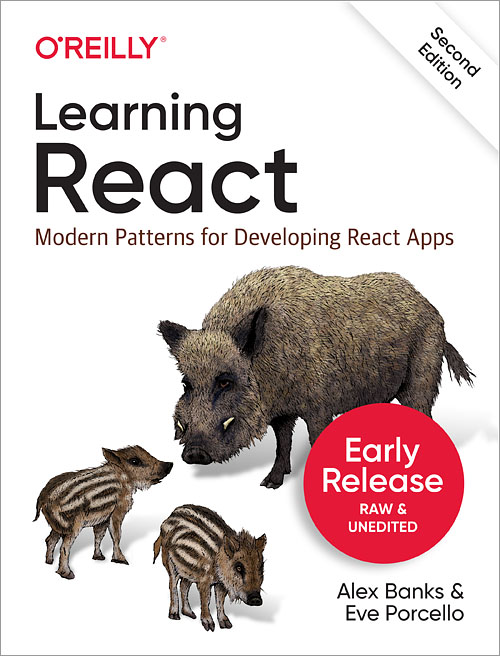

# LEARNING REACT SECOND EDITION
If you want to learn how to build efficient React applications, this project repo is for you. 

In this updated edition provides best practices and patterns for writing modern React code including a deep dive on React Hooks, that will help you to take full advantage of the React library and patterns for writing modern React code.

Note: This project is based on the book [Learning React, Second Edition](https://www.packtpub.com/web-development/learning-react-second-edition) by [Alex Banks](https://www.linkedin.com/in/alex-banks-3b3b3b1/) and [Eve Porcello](https://www.linkedin.com/in/eveporcello/).

- Get the book from [Amazon](https://www.amazon.com/Learning-React-Modern-Patterns-Developers/dp/1492051721) or [O'Reilly](https://www.oreilly.com/library/view/learning-react-second/9781492051725/)
- Also the github repo for the book is [here](https://github.com/MoonHighway/learning-react/blob/second-edition/README.md)

## Project Book Cover

## Table of Contents
- [Chapter 1: Welcome to React and Installation](./chapter-01/README.md)
- [Chapter 2: JavaScript For React](./chapter-02)
- [Chapter 3: Functional Programming With JavaScript](./chapter-03/)
- [Chapter 4: How React Works](./chapter-04/)
- [Chapter 5: React With JSX](./chapter-05/)
